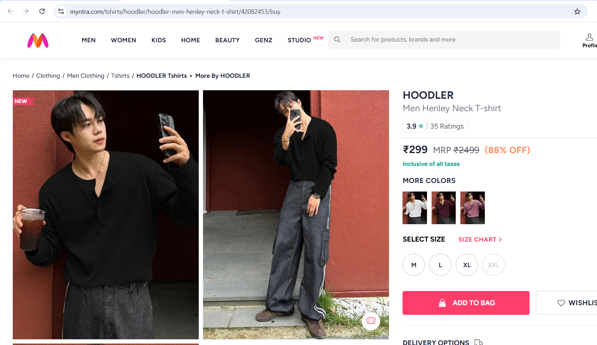
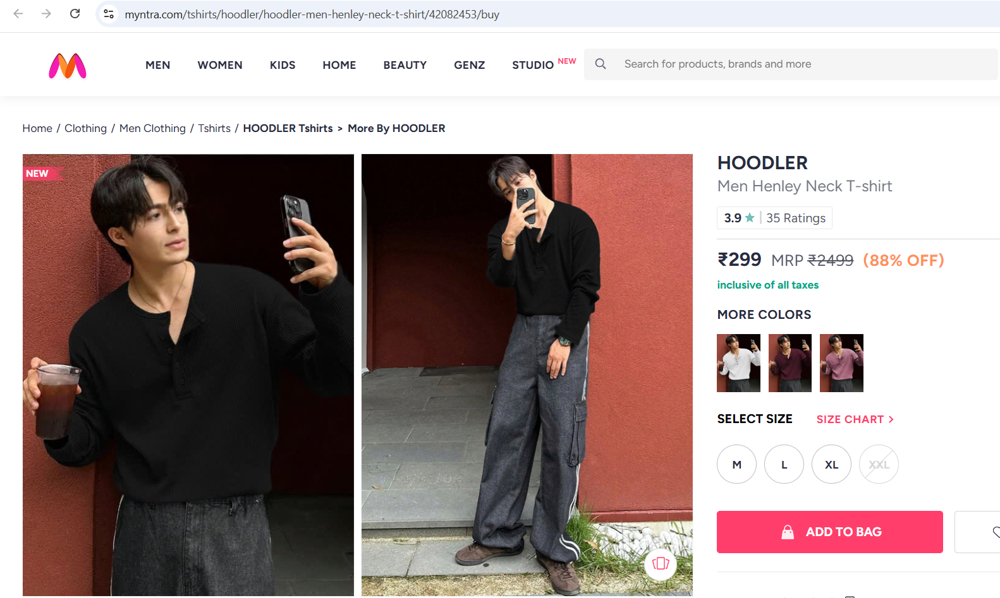
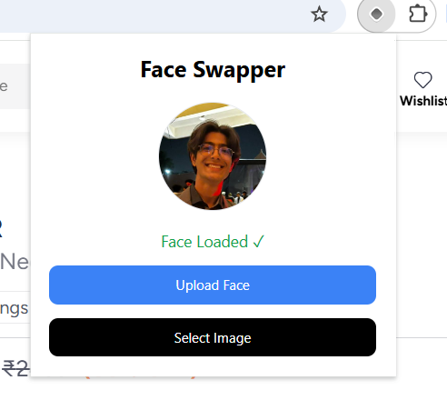

# FaceSwapper Chrome Extension

Transform faces on any website with a single click.

FaceSwapper is a Chrome extension powered by FaceFusion that allows users to upload a source face and replace faces in images directly from their browser. The extension works on both traditional image elements and websites that use CSS background images, making it compatible with many modern e-commerce and content platforms.

---
## Video demo -
https://drive.google.com/file/d/1022xZYBwYQOiECWrBa0hXvZSV1ehhS-n/view?usp=sharing

---

## Features

* Upload a source face through a simple popup interface
* One-click face swapping on supported websites
* Supports:

  * HTML `` elements
  * CSS `background-image` elements
* Loading overlay while face swapping is in progress
* Prevents image viewers and lightboxes from opening during selection
* Persistent source face storage using Chrome Storage API
* FaceFusion-powered backend processing
* Automatic temporary file cleanup
* Works directly inside existing webpages without page refresh

---

## How It Works

```text
Upload Source Face
        ↓
Enable Selection Mode
        ↓
Select Target Image
        ↓
Backend Downloads Target
        ↓
FaceFusion Processes Images
        ↓
Swapped Result Generated
        ↓
Image Replaced On Page
```


## Before Face Swap



### Face Swap Result



### Extension Popup



---

## Architecture

```text
FaceSwapper
│
├── backend
│   ├── Express Server
│   ├── FaceFusion Integration
│   ├── Image Processing
│   └── Temporary File Cleanup
│
└── extension
    ├── Popup UI
    ├── Content Script
    ├── Background Script
    └── Chrome Storage
```

### Extension Flow

```text
User Uploads Face
        ↓
Stored in chrome.storage.local
        ↓
Selection Mode Enabled
        ↓
User Clicks Target Image
        ↓
Content Script Extracts Image URL
        ↓
Background Script Sends Request
        ↓
Backend Processes Face Swap
        ↓
Result URL Returned
        ↓
Page Image Updated
```

---

## Tech Stack

### Frontend / Extension

* Plasmo
* TypeScript
* Chrome Extension APIs

### Backend

* Node.js
* Express.js
* Axios

### AI Processing

* FaceFusion
* Ghost Face Swapper Model
* InSwapper Model Support

---

## Installation

### Clone the Repository

```bash
git clone https://github.com/your-username/faceswapper.git
cd faceswapper
```

---

### Configure FaceFusion

Create a `.env` file inside the backend directory:

```env
FACEFUSION_PATH=C:\Path\To\FaceFusion
FACEFUSION_PYTHON=C:\Path\To\FaceFusion\.venv\Scripts\python.exe
FACEFUSION_MODEL=ghost_3_256
```

---

### Install Backend Dependencies

```bash
cd backend
npm install
npm run dev
```

Backend runs at:

```text
http://localhost:5000
```

---

### Install Extension Dependencies

```bash
cd extension
npm install
npm run dev
```

Load the generated extension build from:

```text
chrome://extensions
```

Enable Developer Mode and select **Load unpacked**.

---

## Usage

1. Open the extension popup.
2. Upload a source face.
3. Enable Selection Mode.
4. Click a target image on a webpage.
5. Wait for processing.
6. View the swapped result directly on the page.

---

## Supported Content

### Supported

* Product images
* Fashion websites
* E-commerce platforms
* Static image galleries
* Background-image based layouts

### Tested On

* Amazon
* Myntra
* Generic image-based websites

---

## Current Limitations

* Backend must run locally
* Processing speed depends on available hardware
* Some highly dynamic websites may re-render modified images
* No cloud deployment yet

---

## Future Improvements

* Context menu face swapping
* Multiple saved source faces
* Cloud hosted backend
* Face swap history
* Improved visual image picker
* Cross device syncing


---

## Why This Project?

Many face-swapping tools require users to manually upload source and target images. FaceSwapper streamlines the workflow by allowing users to select images directly from any webpage and perform face swaps without leaving the browser.

This project was built to explore:

* Chrome Extension Development
* Browser Automation
* AI Image Processing
* FaceFusion Integration
* Full-Stack System Design

---


